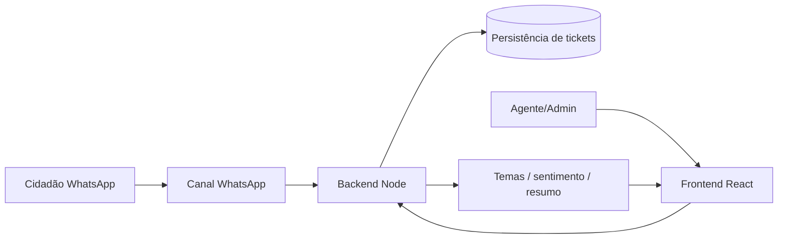

# Arquitetura — AtendPolitiq

```mermaid
flowchart LR
  Citizen[Cidadão WhatsApp] --> WA[Canal WhatsApp]
  WA --> API[Backend Node]
  API --> DB[(Persistência de tickets)]
  Agent[Agente/Admin] --> UI[Frontend React]
  UI --> API
  API --> Intel[Temas / sentimento / resumo]
  Intel --> UI
```

## Qualidade

- RBAC por papel
- Ticket como unidade operacional
- Visão territorial (mapa por bairro)
