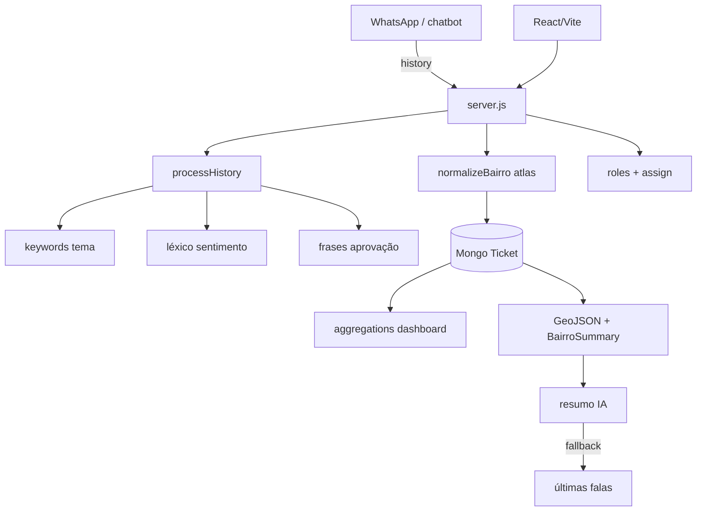

# Arquitetura — AtendPolitiq (profundidade)

## Peças

- `keywords.js` — taxonomia política local
- `bairros.js` + `dqdecaxias.geojson` — território
- `BairroSummary` — cache de inteligência por bairro
- RBAC `superadmin/admin/user/agent`
