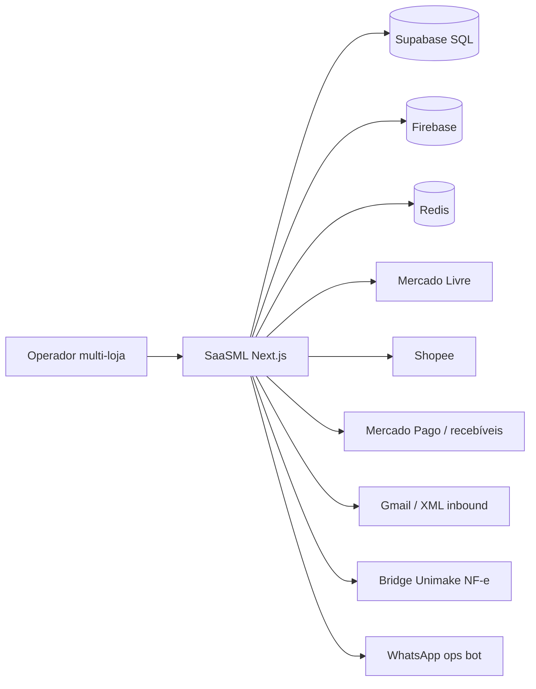

# Arquitetura — SaaSML (C4-lite aprofundada)

## Context

## Containers / bounded contexts (no código)

| Contexto | Artefatos |
|----------|-----------|
| Control Tower | `control-tower-*`, shadow parity, row view-model |
| Order sync | `order-sync-background-worker`, `order-sync-state`, ML/Shopee clients |
| Money truth | `shopee-order-revenue`, `order-costs`, `history-read-model`, `receipts-reconciliation`, `settlement-policy` |
| Fiscal | `unimake-nfe`, `services/unimake-dfe-bridge`, Focus/Bling adapters |
| Multi-store | `store-scope`, SQL `*_store_scope.sql` |

## Fluxo crítico: pedido → margem honesta

1. Worker sincroniza lojas com timeout/concorrência  
2. Receita Shopee só “quebra” se gross existe  
3. Custos montam snapshot versionado no History  
4. UI mostra tooltip com aviso de custo incompleto  
5. Recebíveis reconciliam expected vs marketplace  

## Qualidade

Vitest em receita, reconciliação, parity, boot, custos · SQL de índice/read model · Docker
