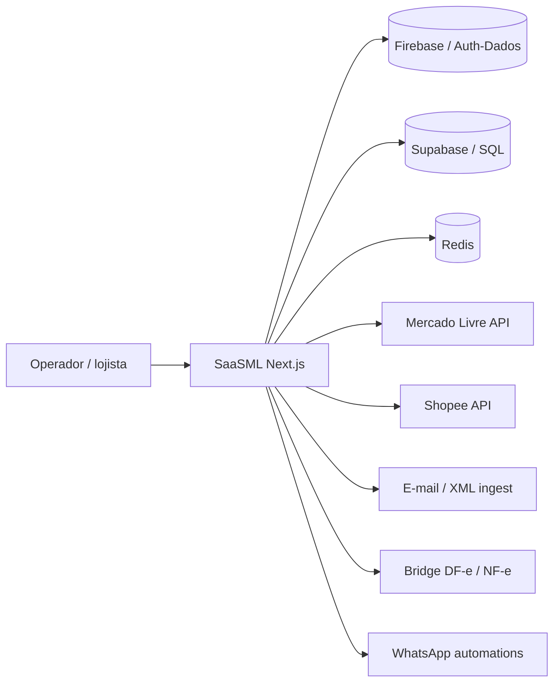

# Arquitetura — SaaSML (C4-lite)

Repo privado. Diagrama conceitual (sem endpoints secretos).

## Context

## Containers

| Container | Responsabilidade |
|-----------|------------------|
| Next.js app | UI + APIs de domínio (inventário, pedidos, financeiro, mapas) |
| unimake-dfe-bridge | Isolamento fiscal/XML/NF-e |
| SQL scripts | Evolução de schema/índices/reconciliação |
| Deploy/VPS scripts | Publicação controlada |

## Qualidade

- Testes Vitest
- Dockerfile
- Env example sem segredos
- Índices e guardrails operacionais versionados em SQL

## Afirmações perigosas (evitar)

- “100% automático em todos marketplaces” sem matiz
- Expor partner keys / tokens
