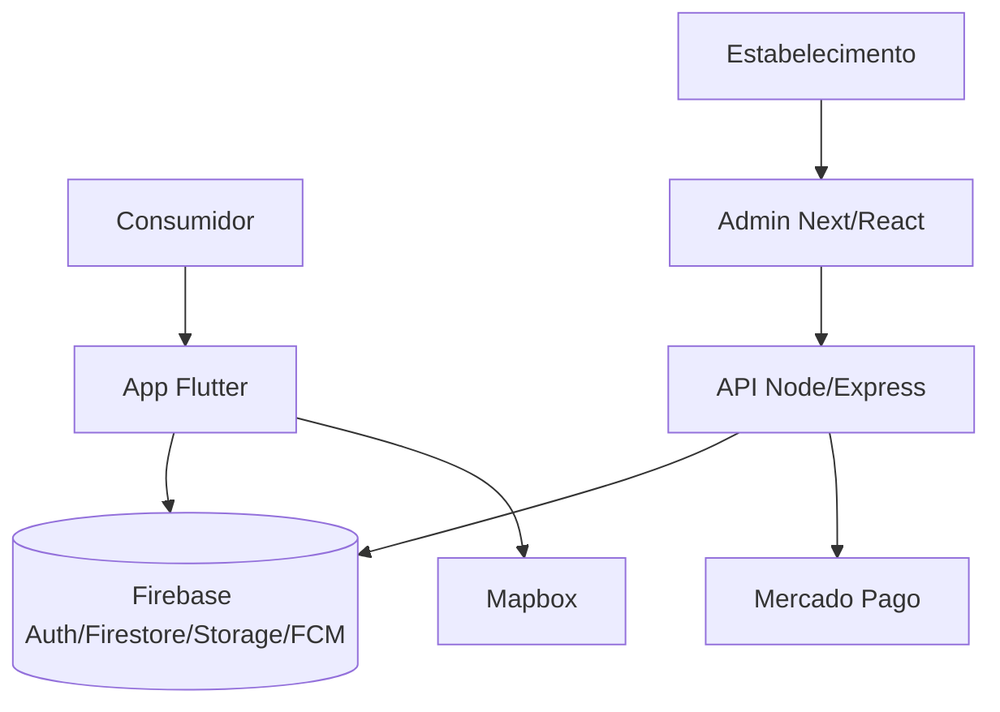

# Arquitetura — Prato Seguro

```mermaid
flowchart TB
  User[Consumidor] --> Mobile[App Flutter]
  Biz[Estabelecimento] --> Admin[Admin Next/React]
  Mobile --> FB[(Firebase Auth/Firestore/Storage/FCM)]
  Admin --> API[API Node/Express]
  API --> FB
  API --> MP[Mercado Pago]
  Mobile --> Map[Mapbox]
```

## Pontos de julgamento

- Um codebase mobile para Android/iOS
- Admin e pagamentos fora do app consumer
- Curadoria de restrições alimentares como domínio central
