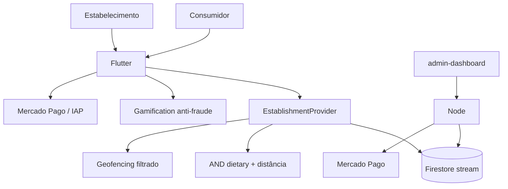

# Arquitetura — Prato Seguro (profundidade)

## Peças

- Filtro conjuntivo de restrições
- Geofence ≤50 regiões, radius 300m, loitering 60s
- Check-in: 1/dia/estabelecimento + cooldown 1h
- Selos compostos (reviews ∩ check-ins ∩ referrals)
