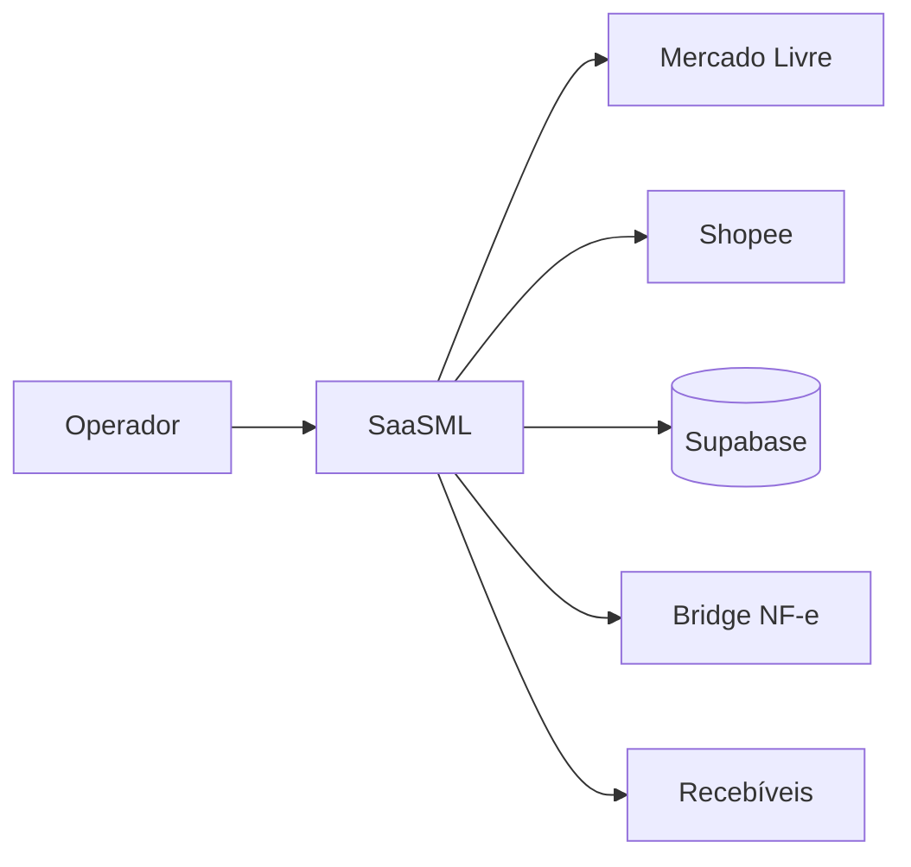

# SaaSML — torre de controle para marketplaces

Sistema operacional para lojas que vendem no **Mercado Livre** e na **Shopee**: sincronizar pedidos, enxergar margem de verdade, emitir NF-e quando faz sentido, reconciliar recebíveis e manter várias lojas no mesmo produto sem misturar contexto.

## O problema

Operar marketplace não é listar pedidos. O operador precisa confiar em números que a API externa entrega pela metade:

- anúncio (bruto) ≠ o que cai de receita depois de cupons
- custo incompleto (sem embalagem/Flex) faz margem parecer boa demais
- sync de várias lojas não pode parar porque uma loja travou
- NF-e própria não se aplica a todo tipo de logística (ex.: Full)
- a tela da torre e o bootstrap do servidor precisam permanecer alinhados

## Abordagem

Monólito modular em **Next.js** com domínio concentrado em `src/lib` (~170 módulos), superfícies em `src/app` (inventory, sales, history, financial, shopee…), SQL versionado, workers de sync, bridge fiscal Unimake e testes Vitest nos contratos críticos.

Detalhe: [architecture/saasml.md](../architecture/saasml.md)

## Destaques de implementação

1. **Contrato de receita Shopee** — só monta cascade anúncio→cupons→receita quando existe gross persistido ([snippet](../snippets/saasml/shopee-revenue-contract.md))
2. **History com snapshot v2** — invalida snapshots antigos quando muda a regra de margem ([snippet](../snippets/saasml/history-cost-snapshot.md))
3. **Shadow parity da Control Tower** — diff de IDs entre cliente e bootstrap ([snippet](../snippets/saasml/control-tower-shadow-parity.md))
4. **Sync worker** — concorrência por loja + timeout para uma falha não segurar o lote ([snippet](../snippets/saasml/order-sync-worker.md))
5. **NF-e própria** — bloqueio em envio Full, idempotência se já existe documento, correção de cidade/IBGE via CEP ([snippet](../snippets/saasml/nfe-full-guard.md))
6. **Settlement policy** — regras por branch (fornecedor/expedição/Flex), prioridade e modo shadow→active
7. **Escopo multi-loja tipado** — `all | single | none` com guardrail de ação

## Decisões

| Escolhi | Em vez de | Porque |
|---------|-----------|--------|
| Next modular | microserviços cedo | um deploy, velocidade solo, fronteiras em `lib/` + SQL |
| Snapshots financeiros versionados | recalcular tudo na listagem | lista rápida sem mentir quando o contrato muda |
| Bridge NF-e separado | embutir fiscal no request web | XML/autorização é outro ritmo de falha |
| Shadow parity | “confiar que migrou” | drift de bootstrap aparece como relatório, não como surpresa |

## Evolução

Extrair workers dedicados conforme o volume de reconciliação cresce; publicar contratos internos (OpenAPI) para acelerar novas superfícies da torre.

## Stack

Next.js · TypeScript · Supabase/Firebase · Redis · Vitest · Docker · integrações ML/Shopee · Unimake DF-e
