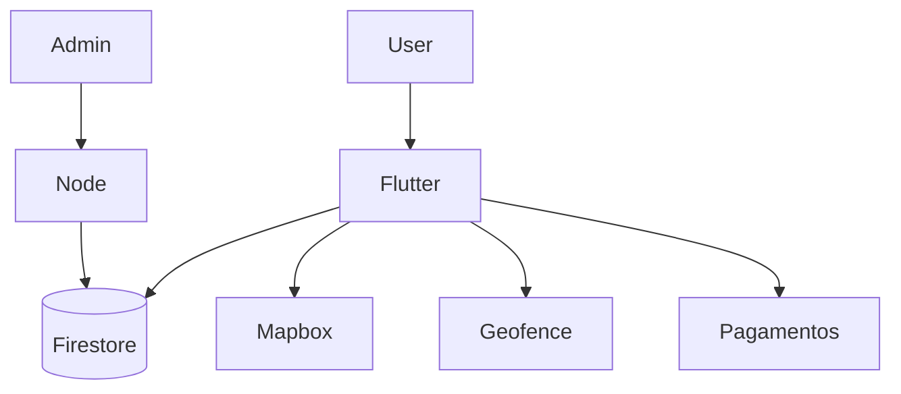

# Prato Seguro — mapa seguro para restrições alimentares

App **Flutter** (Android/iOS) para pessoas com restrição alimentar encontrarem estabelecimentos compatíveis no mapa — com painel admin, pagamentos e uma camada business (menu, delivery, cupons, boost).

## O problema

Busca genérica de “restaurante perto” não responde: “posso comer *aqui* com *essas* restrições?”. O produto precisa filtrar por conjunto de restrições, gerar confiança (check-in, review, selos) e servir também o lado do estabelecimento.

## Abordagem

- App Flutter com models/providers/services/screens claros
- Firestore em tempo real para o catálogo
- Mapbox + geofencing
- Gamificação com regras contra abuso
- Admin web (Next/React + Node) e Mercado Pago / IAP

[architecture/safeplate.md](../architecture/safeplate.md)

## Destaques de implementação

1. **Filtro dietético em AND** + stream Firestore que reaplica filtros e atualiza geofences ([snippet](../snippets/safeplate/dietary-filters-stream.md))
2. **Geofencing filtrado** — até 50 regiões, 300m, só lugares que cobrem as preferências do usuário ([snippet](../snippets/safeplate/geofencing-dietary.md))
3. **Check-in anti-abuso** — 1×/estabelecimento/dia + cooldown 1h; contorna limite do Firestore de múltiplos range filters ([snippet](../snippets/safeplate/checkin-antifraud.md))
4. **Selos** Bronze → Prata → Ouro por combinação de check-ins, reviews e indicações
5. **Modo business no mesmo app** — menu, delivery, boost, cupons, onboarding de estabelecimento

## Decisões

| Escolhi | Porque |
|---------|--------|
| Flutter | um código para as duas lojas |
| Firebase | auth, dados e push com ciclo solo |
| Geofence ligado ao filtro dietético | notificação só quando o lugar serve à restrição |
| Regras rígidas de check-in | ranking sem farm trivial |

## Evolução

Separar com mais nitidez o monorepo (evitar cópias aninhadas de outros apps) e endurecer o pipeline mobile (Codemagic) como porta padrão de release.

## Stack

Flutter/Dart · Firebase · Mapbox · Provider · Mercado Pago · admin Next/Node
