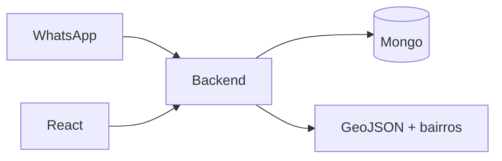

# AtendPolitiq — atendimento político com visão territorial

Dashboard para times de mandato acompanharem conversas de cidadãos no **WhatsApp**: cada conversa vira ticket, ganha tema e sentimento, entra no mapa por bairro e alimenta indicadores do dia.

## O problema

Demanda cidadã chega espalhada. Sem fila, papel e território, o time não sabe o que mais dói em cada bairro nem quem está responsável por cada caso.

## Abordagem

Backend Node (`server.js`) + frontend React/Vite. Pipeline:

1. normalizar histórico (texto `user:/assistant:` ou JSON)
2. classificar tema (keywords) e sentimento (léxico)
3. medir sinais de aprovação (“obrigado”, “excelente atendimento”…)
4. normalizar bairro contra atlas local de Duque de Caxias
5. persistir ticket com `assignedTo`
6. agregar dashboard e gerar resumo por bairro (OpenAI, com fallback local)

[architecture/atendpolitiq.md](../architecture/atendpolitiq.md)

## Destaques de implementação

1. **Parser de histórico flexível** + taxonomia de temas ([snippet](../snippets/atendpolitiq/history-theme.md))
2. **Atlas de bairros + GeoJSON** com match fuzzy (sem diacrítico) e cache `BairroSummary`
3. **Resumo territorial com IA** e fallback determinístico se a API falhar ([snippet](../snippets/atendpolitiq/bairro-ai-summary.md))
4. **RBAC** `superadmin | admin | user | agent` — agente só vê a própria fila; assign restrito ([snippet](../snippets/atendpolitiq/rbac-assign.md))
5. Agregações de dashboard: resolvidos/dia, conversas/dia, tema dominante, aprovação ao longo do tempo

## Decisões

| Escolhi | Porque |
|---------|--------|
| Keywords para tema | barato, explicável, offline |
| OpenAI só no resumo do mapa | custo controlado onde o texto agregado importa |
| Atlas local de bairros | robustez à digitação do cidadão/chatbot |
| Papéis na API e nas rotas | operação real de time, não inbox único |

## Evolução

Modularizar o backend além do single-file e, se o volume crescer, introduzir fila para ingestão e recálculo de resumos.

## Stack

Node · Express · MongoDB · React/Vite · OpenAI · GeoJSON
